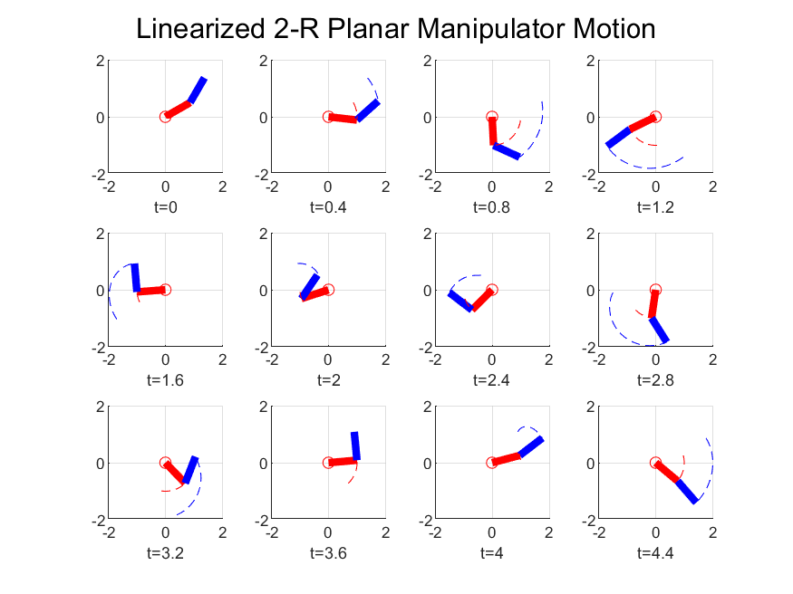

# Modeling-and-Control-of-Mechatronics-Systems
Solutions to HW problems with Matlab and Simulink Files
It is not guaranteed that all of them are correct. 
Hw1 is basically for system modelling and Hw2 is for simulation.

--An example is as follows

